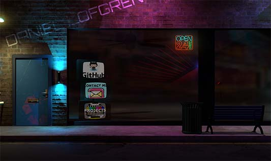

### Hi there, I am Daniel Lofgren 

I am a Full-stack Web Developer who love writing and thinking about code. 

- 🔭 I’m currently working on delivering and maintaining websites for clients as a freelance web developer.

📫 Reach me at: 

### Skills 🦾

- Front End Web Development with Angular and React
- Back End Web Development with Node.js and Python (FastAPI) 
- Google Firebase
- Modern C++
- Machine learning with Tensorflow and Keras
- Dockerizing Apps

### Passions 👾

- Machine Learning
- Game Development
- Solving and thinking about problems 

### Proof of concept 3d Showcase site:

[https://tylder.github.io/portfolio3d/](https://tylder.github.io/portfolio3d/)

### Most often used Technologies & Tools 🔧 

***

